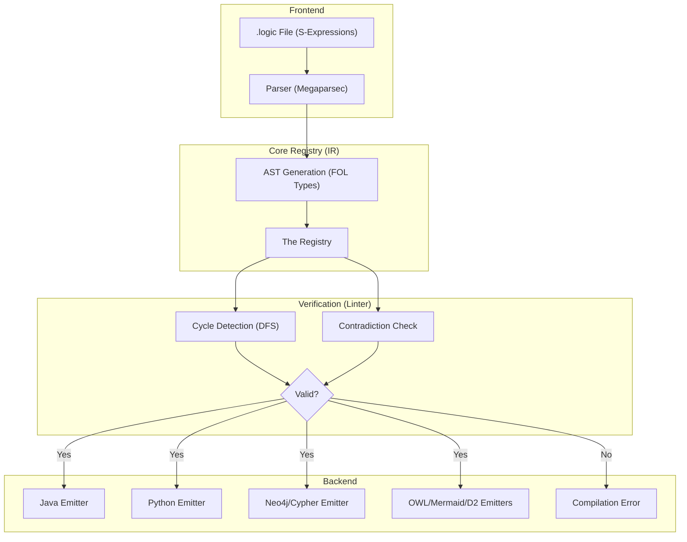
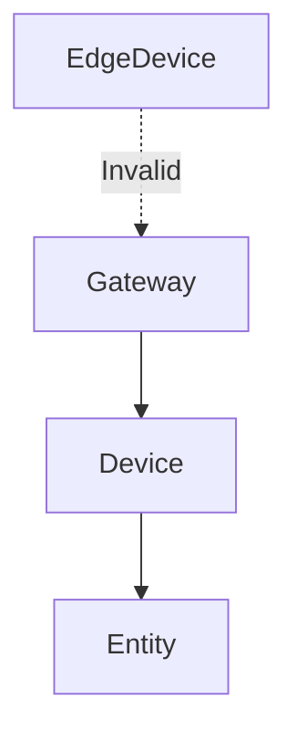
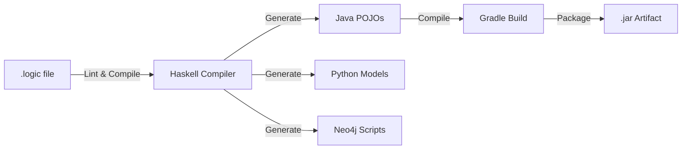

# Project Architecture: OntoLogic

OntoLogic is a **multi-target logic transpiler** designed for IoT ecosystems. It follows a classic compiler architecture: **Frontend (Parser) → IR (Registry) → Linter → Backend (Emitters).**

---

## I. The Logical Pipeline

The transpiler treats logic as a data structure, not text. This ensures that a rule defined in a `.logic` file is functionally identical across all targets.

### Transpilation Flow

1. **Parsing (Haskell/Megaparsec):** Converts S-expressions into a First-Order Logic AST. The `Parser.hs` module handles the recursive descent through terms, predicates, and logical operators (`and`, `or`, `implies`, etc.).
2. **Unified Registry (The IR):** A central repository (`OntoLogic.hs`) that stores all concepts, their inheritance graphs, and their axioms. This registry maintains the "Single Source of Truth."
3. **The Linter (The Guard):** Performs graph analysis (`Linter.hs`) to detect circular inheritance using a Depth-First Search (DFS) and checks for basic axiom contradictions (e.g., `P and Not P`).

---

## II. Inheritance & Dependency Mapping

The linter uses a Directed Acyclic Graph (DAG) to represent the hierarchy. This prevents "Logic Bombs" like circular inheritance.

* **Valid:** `Gateway → Device → Entity`
* **Invalid:** `Gateway → EdgeDevice → Gateway` (Caught by Haskell DFS Linter).

---

### III. Target Mapping Strategy

Each language "interprets" the First-Order Logic according to its own strengths.

| Component | IR (Haskell) | Python (Pydantic) | Java (Gradle/Jakarta) | Neo4j (Cypher) |
| :--- | :--- | :--- | :--- | :--- |
| **Concept** | `Concept` | `class` | `class` | `:Node` |
| **Axiom** | `Implies` | `@model_validator` | `@Min/@Max/@Assert` | `MATCH ... WHERE` |
| **Registry** | `Map` | `__init__` logic | `Module` | `Graph Schema` |

---

### IV. Build Orchestration

The project uses **Gradle** as the top-level orchestrator for the JVM ecosystem and **Docker Compose** for the runtime environment.

---

### V. IoT Deployment Pattern (HiveMQ)

In a production HiveMQ environment, OntoLogic bridges the gap between the broker and the data lake.

1. **Broker (Java):** Uses generated POJOs to validate packets at the edge.
2. **Reasoning (Neo4j):** Periodically audits the entire fleet for logical inconsistencies.
3. **Analysis (Python):** Ingests validated data for ML and reporting.

---

### VI. The Validation Feedback Loop

The Batch Loader acts as the runtime enforcement of the First-Order Logic.

1. **Static Validation:** Done at compile-time by the Haskell Linter.
2. **Dynamic Validation:** Done at ingest-time by the Python/Java models.
3. **Structural Reasoning:** Done post-ingest by Neo4j Cypher queries.
